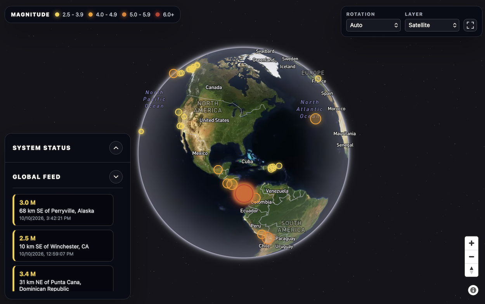

# Earthquake Tracker

An interactive 3D globe for exploring recent earthquakes around the world. Built with React, Vite, and Mapbox GL JS, the app turns USGS earthquake data into a visual dashboard with magnitude markers, event details, and a chronological feed.

**[View the live demo](https://surasb11.github.io/Earthquake-tracker/)**



## Features

- **Satellite globe intro** that fades into the live tracker after about 3.6 seconds, with Skip intro and reduced-motion support. The map and data load underneath the overlay.
- **Interactive 3D globe** with zoom, navigation, and rotation controls.
- **Recent earthquake data** showing magnitude 2.5+ events from yesterday and today.
- **Magnitude visualization** using color-coded markers that scale with earthquake strength.
- **Event details** showing magnitude, location, local date and time, and a Read More link to the USGS event page.
- **Global Feed** listing the 20 most recent events in the current time window.
- **System panel** showing the event count, strongest earthquake, and data status.
- **Four map layers:** Telemetry, Satellite, Ocean / Terrain, and Street.
- **Foldable panels** and a fullscreen view that hides the dashboard panels.
- **Responsive layout** with a magnitude legend above collapsible SYSTEM and FEED sections on mobile. Both sections start closed; opening one closes the other.

## How the data works

The app fetches the [USGS M2.5+ weekly GeoJSON feed](https://earthquake.usgs.gov/earthquakes/feed/v1.0/summary/2.5_week.geojson) and filters it to events between **yesterday at midnight and the current time**, using the viewer's local timezone. This is a calendar-day window, rather than a fixed rolling 48 hours.

Data refreshes every five minutes while the app is running. The app also refreshes when the page becomes visible again and updates the time window at local midnight. If a request fails, previously loaded events remain visible while events outside the time window are removed.

## Tech stack

| Technology | Purpose |
| --- | --- |
| React | Interface and application state |
| Vite | Development server and production builds |
| Mapbox GL JS | Globe rendering, map layers, and navigation |
| react-map-gl | React integration for Mapbox |
| CSS | Dashboard styling and responsive layout |
| USGS GeoJSON | Earthquake data |

## Run locally

### Requirements

- Node.js 24 (recommended) or Node.js 22.13+ in the 22.x release line, and npm.
- A [Mapbox account and public access token](https://docs.mapbox.com/help/getting-started/access-tokens/).

### Setup

1. Clone or download this repository, then open a terminal in the project folder containing `package.json`.
2. Install the dependencies:

   ```bash
   npm ci
   ```

3. Create a file named `.env.local` in the project root and add your Mapbox public token:

   ```env
   VITE_MAPBOX_TOKEN=your_mapbox_public_token_here
   ```

4. Start the development server:

   ```bash
   npm run dev
   ```

5. Open the local URL printed in your terminal.

## Available commands

| Command | Purpose |
| --- | --- |
| `npm run dev` | Start the development server |
| `npm run build` | Generate the production build in `dist/` |
| `npm run preview` | Preview the production build locally |
| `npm run lint` | Run ESLint |

## Deploy to GitHub Pages

The deployment workflow builds the app and publishes `dist/` to
https://surasb11.github.io/Earthquake-tracker/. Vite uses `/Earthquake-tracker/`
as the base path so scripts, styles, and the favicon load from the project URL.

1. In this repository's **Settings → Pages**, set **Source** to **GitHub Actions**.
2. In **Settings → Secrets and variables → Actions**, add a repository secret
   named `VITE_MAPBOX_TOKEN` containing your Mapbox **public** token (`pk.`).
   A repository Actions variable with the same name is also supported. If both
   exist, the secret takes precedence. Never use a Mapbox secret token (`sk.`).
3. If the token has URL restrictions, allow this GitHub Pages site in Mapbox.
4. Push the deployment changes to `main`. Subsequent pushes to `main` deploy
   automatically. To deploy again after changing the token, open **Actions →
   Deploy to GitHub Pages → Run workflow** and select `main`.
5. Wait for both the build and deployment jobs to finish successfully before
   opening the site.

The workflow uses Node.js 24, installs dependencies with `npm ci`, runs lint,
and builds with the token provided at build time. It fails with a configuration
message if the token is missing or does not start with `pk.`. Changing the token
requires a new build because Vite embeds it in the browser bundle.

Keep `.env.local`, `node_modules/`, and `dist/` ignored and untracked. GitHub
Actions receives the public token from repository settings and uploads the
generated site as a Pages artifact; these files do not need to be committed.

## Project structure

- `src/App.jsx` — globe, panels, controls, data fetching, and time filtering.
- `src/App.css` — dashboard styles and mobile layout.
- `src/TrackerIntro.jsx`, `src/TrackerIntro.css`, and `src/introGlobe.js` — introduction overlay and satellite globe animation.
- `src/index.css` — global styles.
- `src/main.jsx` — React entry point.
- `public/` — favicon and preview assets.
- `index.html` — page title, metadata, and app root.

## Configuration and repository notes

- Keep `.env.local` out of Git. A placeholder configuration is provided in `.env.example`.
- Vite includes `VITE_` values in the browser bundle, so use a Mapbox **public** token here, never a secret token.
- `node_modules/` and `dist/` are generated locally and are excluded from Git.
- Map rendering and earthquake updates require an internet connection.

## Data and credits

Earthquake data: [U.S. Geological Survey](https://earthquake.usgs.gov/earthquakes/feed/v1.0/geojson.php). Maps and globe rendering: [Mapbox](https://www.mapbox.com/).

Intro satellite imagery: [NASA Visible Earth, Blue Marble](https://visibleearth.nasa.gov/images/57730/blue-marble-land-surface-ocean-color-and-sea-ice), using the image supplied in the design reference.

Created by **Sura Baghirova**.
